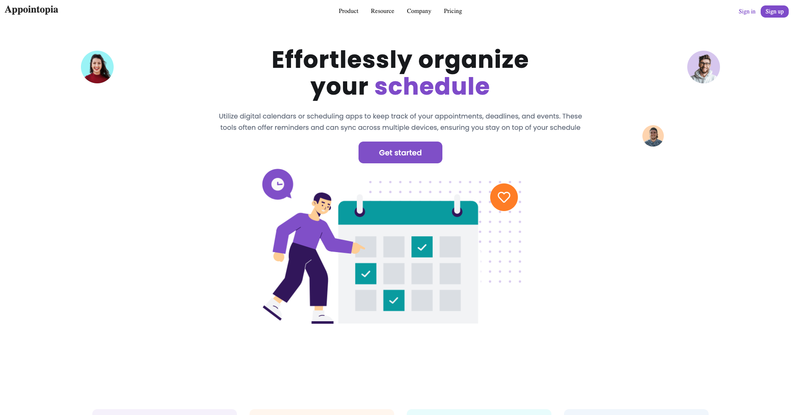
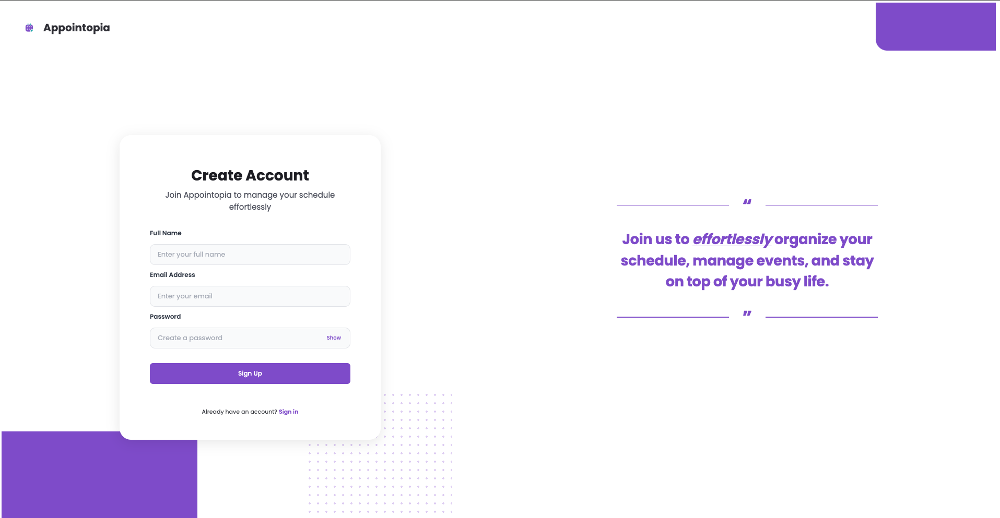
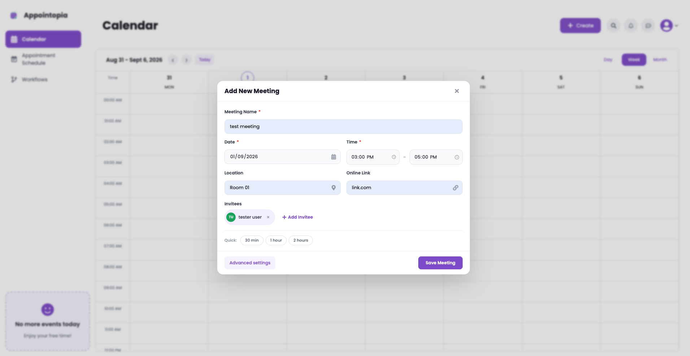
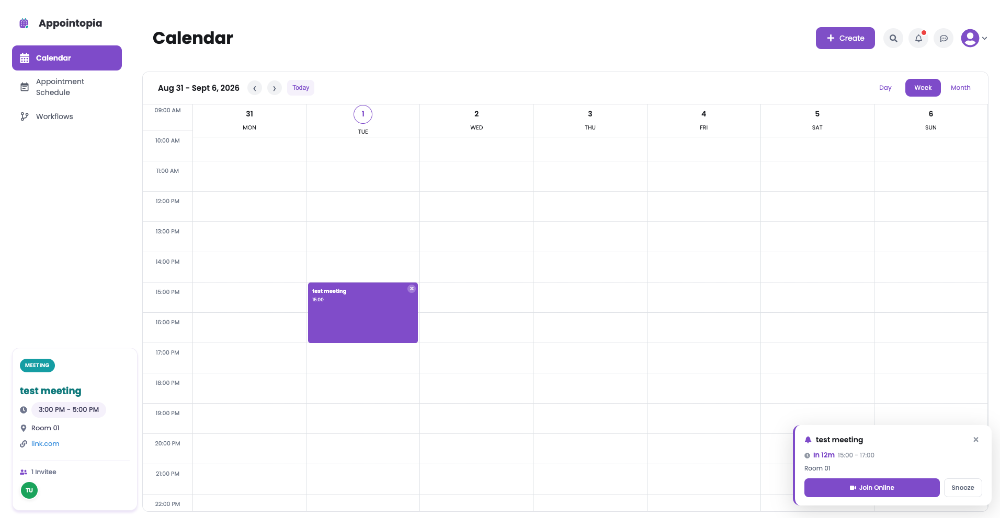
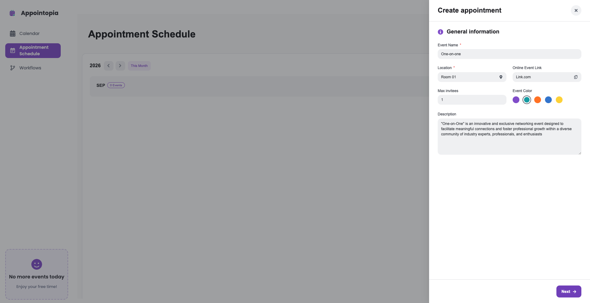
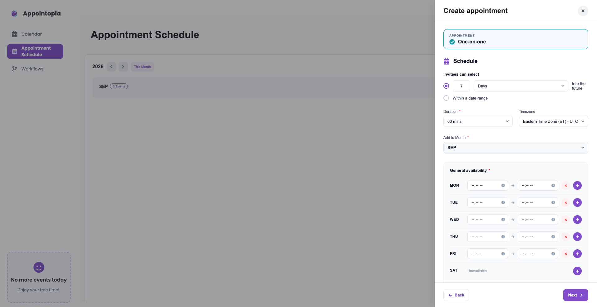
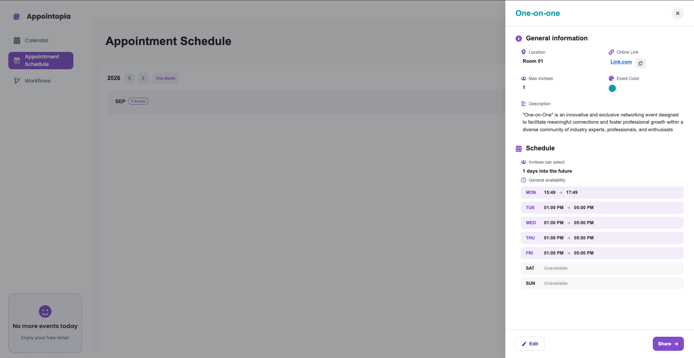
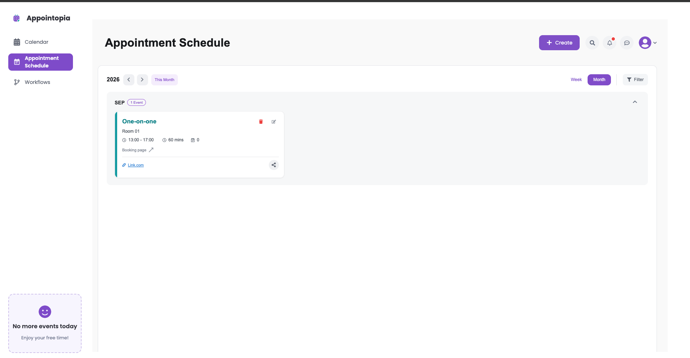
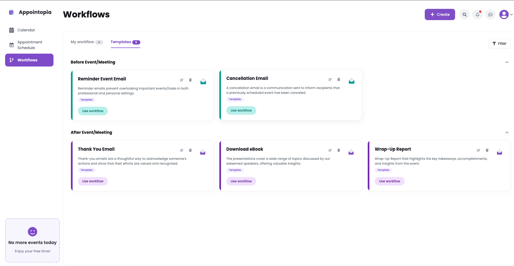
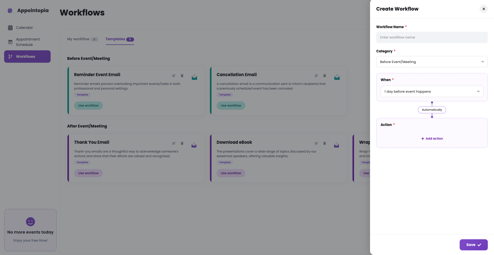

# 📅 Appointopia - Online Appointment Schedule

A modern, full-featured appointment scheduling application built with React. Manage your meetings, appointments, and schedules with an intuitive and responsive interface.

[](https://reactjs.org/)
[](https://firebase.google.com/)
[](https://vitejs.dev/)
[](https://www.emailjs.com/)
[](#license)


---

## ✨ Features

### 📊 Calendar Management
- **Multiple Views**: Day, Week, and Month views for flexible scheduling.
- **Event Creation**: Create, edit, and delete meetings with ease.
- **Color Coding**: Assign colors to different event types for better visualization.
- **Smart Reminders**: Get notified about upcoming meetings with automatic reminders.
- **Search Meetings**: Quick search functionality to find any meeting instantly.
- **Smart Event Grouping**: Expandable "+X More" views for days with many events.
- **Meeting Invites**: Add invitees with email notifications.
- **Share Meetings**: Copy meeting links or share via native share API.

### 📋 Appointment Scheduling
- **Appointment Cards**: Visual representation of all appointments with a unique V-shape hover effect.
- **Booking Pages**: Each appointment gets a unique, shareable booking page.
- **Duration Management**: Set custom durations for appointments (30, 60, 90 mins).
- **Availability Settings**: Define your working hours and availability per day.
- **Workflow Automation**: Set up automations around your events.
- **Inline Editing**: Edit appointments directly with full form controls.
- **Color Picker**: Choose from 10+ colors to customize appointment appearance.
- **Professional Week View**: Detailed calendar grid with time slots.

### 🔔 Toast Notification System
- **Real-time Feedback**: Instant notifications for all user actions.
- **Multiple Types**: Support for Success, Error, Warning, Info, and Loading states.
- **Auto-Dismiss**: Configurable duration with a progress bar.
- **Stack Support**: Multiple notifications stack gracefully.
- **Responsive Design**: Works seamlessly on all screen sizes.
- **Loading Transitions**: Smooth transitions from loading to success/error states.

### 👤 User Management
- **Authentication**: Secure sign-in and sign-up with Firebase.
- **Profile Management**: Update personal information and preferences.
- **User Settings**: Customize your experience (notifications, default view, dark mode).
- **Session Management**: Auto-logout and session persistence.
- **Delete Account**: Securely delete your account with a confirmation prompt.

### 📱 Responsive Design
- **Mobile-Friendly**: Works seamlessly on all devices.
- **Touch Optimized**: Smooth interactions on touch devices.
- **Adaptive Layouts**: Interface auto-adjusts to different screen sizes.

### 🎨 User Interface
- **Modern Design**: Clean, professional UI with a distinctive purple theme.
- **Animations**: Smooth transitions and interactions for a polished feel.
- **V-Shape Hover**: Unique card hover effects in the appointment grid.
- **Iconography**: Rich icon set for better visual communication.
- **Typography**: Clean, readable fonts for enhanced user experience.

---

## 📸 Screenshots

### Landing Page


### Sign Up


### Calendar — Add New Meeting


### Calendar — Week View


### Create Appointment — General Information


### Create Appointment — Schedule


### Appointment Details


### Appointment Schedule List


### Workflows — Templates


### Workflows — Create Workflow


---

## 🛠️ Tech Stack

### Frontend
- **[React 18](https://reactjs.org/)** - UI Framework
- **[React Router DOM 6](https://reactrouter.com/)** - Navigation & Routing
- **[React Icons](https://react-icons.github.io/react-icons/)** - Icon library
- **[CSS3](https://developer.mozilla.org/en-US/docs/Web/CSS)** - Custom styling with responsive design
- **[Vite](https://vitejs.dev/)** - Build tool and development server

### Backend & Services
- **[Firebase Authentication](https://firebase.google.com/products/auth)** - Secure user authentication
- **[Firebase Firestore](https://firebase.google.com/products/firestore)** - Real-time NoSQL database
- **[EmailJS](https://www.emailjs.com/)** - Email notifications for meeting invites

### State Management
- **[React Context API](https://reactjs.org/docs/context.html)** - Global state management (Toast, Notifications, Appointments)
- **Local Storage** - Persistent data storage and caching

### Development Tools
- **[Vite](https://vitejs.dev/)** - Build tool and development server
- **[ESLint](https://eslint.org/)** - Code quality & linting
- **[Git](https://git-scm.com/)** - Version control

---

## 📁 Project Structure

This reflects the actual structure of the `Appointopia-App/` folder in the repository:

```
Appointopia-App/
├── public/
│   └── favIcon.svg
├── src/
│   ├── assets/
│   │   ├── hero/                       # Hero section images
│   │   └── images/                     # Icons & general images (logo, social, illustrations)
│   ├── component/                      # Reusable UI components
│   │   ├── AppointmentSchedule/        # Appointment cards & schedule list
│   │   │   ├── AppointmentCard.jsx
│   │   │   ├── AppointmentCard.css
│   │   │   ├── AppointmentSchedule.jsx
│   │   │   └── appointmentSchedule.css
│   │   ├── AuthPage/                   # Sign in / Sign up
│   │   │   ├── SignIn.jsx
│   │   │   ├── SignUp.jsx
│   │   │   └── auth.css
│   │   ├── Calendar/                   # Calendar views & modals
│   │   │   ├── Calendar.jsx
│   │   │   ├── DayView.jsx
│   │   │   ├── WeekView.jsx
│   │   │   ├── MonthView.jsx
│   │   │   ├── AddMeetingModal.jsx / .css
│   │   │   ├── AddInviteeModal.jsx / .css
│   │   │   ├── EventDetailsModal.jsx / .css
│   │   │   ├── Reminder.jsx / .css
│   │   │   └── calendar.css
│   │   ├── Comman/                     # Shared Topbar component
│   │   │   ├── Topbar.jsx
│   │   │   └── Topbar.css
│   │   ├── CreateAppointment/          # Appointment creation modal
│   │   │   ├── CreateAppointment.jsx
│   │   │   └── createAppointment.css
│   │   ├── Faq/
│   │   │   ├── Faq.jsx
│   │   │   └── faq.css
│   │   ├── Footer/
│   │   │   ├── Footer.jsx
│   │   │   └── footer.css
│   │   ├── GetStarted/
│   │   │   ├── GetStarted.jsx
│   │   │   └── getstarted.css
│   │   ├── Hero/
│   │   │   ├── Hero.jsx
│   │   │   └── hero.css
│   │   ├── Navbar/
│   │   │   ├── Navbar.jsx
│   │   │   └── navbar.css
│   │   ├── Scheduling/
│   │   │   ├── Scheduling.jsx
│   │   │   └── scheduling.css
│   │   ├── Sidebar/
│   │   │   ├── Sidebar.jsx
│   │   │   └── sidebar.css
│   │   ├── Statistics/
│   │   │   ├── Statistics.jsx
│   │   │   └── statistics.css
│   │   ├── Toast/                      # Toast notification system
│   │   │   ├── ToastContainer.jsx
│   │   │   ├── ToastContext.jsx
│   │   │   ├── ToastItem.jsx
│   │   │   ├── useToast.js
│   │   │   ├── index.js
│   │   │   └── toast.css
│   │   ├── WhatsNew/
│   │   │   ├── WhatsNew.jsx
│   │   │   └── whatsnew.css
│   │   ├── Workflows/                  # Workflow automation UI
│   │   │   ├── Workflows.jsx
│   │   │   ├── WorkflowCard.jsx / .css
│   │   │   ├── CreateWorkflowModal.jsx
│   │   │   ├── createWorkflowModal.css
│   │   │   └── workflows.css
│   │   ├── Layout.jsx                  # App shell layout (Sidebar + Topbar)
│   │   └── Layout.css
│   ├── context/                        # React Context providers
│   │   ├── AppointmentContext.jsx
│   │   └── NotificationContext.jsx
│   ├── data/
│   │   └── appointmentData.js          # Seed/mock appointment data
│   ├── firebase/
│   │   └── firebase.js                 # Firebase app configuration
│   ├── hooks/
│   │   └── useNotifications.js
│   ├── layouts/
│   │   ├── FooterLayout.jsx            # Layout wrapper for marketing/footer pages
│   │   └── FooterLayout.css
│   ├── pages/                          # Route-level pages
│   │   ├── AppointmentSchedulePage/
│   │   │   ├── AppointmentSchedulePage.jsx
│   │   │   └── appointmentSchedulePage.css
│   │   ├── CalendarPage/
│   │   │   ├── CalendarPage.jsx
│   │   │   └── calendarPage.css
│   │   ├── CompanyPage/
│   │   │   ├── CompanyPage.jsx
│   │   │   └── companyPage.css
│   │   ├── FooterPages/                # Marketing / static content pages
│   │   │   ├── About/
│   │   │   │   ├── AboutUs.jsx
│   │   │   │   └── ContactUs.jsx
│   │   │   ├── Blog/
│   │   │   │   ├── Organization.jsx
│   │   │   │   ├── Personal.jsx
│   │   │   │   └── Startup.jsx
│   │   │   ├── Legal/
│   │   │   │   ├── Privacy.jsx
│   │   │   │   ├── Sitemap.jsx
│   │   │   │   └── Terms.jsx
│   │   │   ├── Product/
│   │   │   │   ├── Features.jsx
│   │   │   │   └── Pricing.jsx
│   │   │   ├── Resource/
│   │   │   │   ├── Blog.jsx
│   │   │   │   ├── UserGuides.jsx
│   │   │   │   └── Webinars.jsx
│   │   │   └── Page.css
│   │   ├── PricingPage/
│   │   │   ├── PricingPage.jsx
│   │   │   └── pricingPage.css
│   │   ├── ProductPage/
│   │   │   ├── ProductPage.jsx
│   │   │   └── productPage.css
│   │   ├── Profile/
│   │   │   ├── Profile.jsx
│   │   │   └── profile.css
│   │   ├── ResourcePage/
│   │   │   ├── ResourcePage.jsx
│   │   │   └── resourcePage.css
│   │   ├── Setting/
│   │   │   ├── Setting.jsx
│   │   │   └── setting.css
│   │   └── WorkflowsPage/
│   │       ├── WorkflowsPage.jsx
│   │       └── WorkflowsPage.css
│   ├── services/                       # Firebase-backed data/service layer
│   │   ├── authService.js
│   │   ├── firestoreService.js
│   │   └── workflowExecutor.js
│   ├── utils/                          # Utility helpers
│   │   ├── colorUtils.js
│   │   ├── dateTimeHelper.js
│   │   ├── dateUtils.js
│   │   ├── nextEventHelper.js
│   │   └── notificationService.js
│   ├── App.jsx                         # Root component & routes
│   ├── App.css
│   ├── index.css                       # Global styles
│   └── main.jsx                        # Application entry point
├── index.html
├── package.json
├── package-lock.json
├── vite.config.js
└── .oxlintrc.json                      # Linter config
```

---

## 🚦 Getting Started

### Prerequisites
- **Node.js** (v16 or higher)
- **npm** or **yarn** package manager
- A **Firebase** account (for backend services)
- An **EmailJS** account (for email notifications)

### Installation

1. **Clone the repository**
   ```bash
   git clone https://github.com/lalit-sahu-iphtech/Online-Appointment-Schedule.git
   cd Online-Appointment-Schedule
   ```

2. **Install dependencies**
   ```bash
   npm install
   # or
   yarn install
   ```

3. **Set up environment variables**
   Create a `.env` file in the root directory. You can copy the example file:
   ```bash
   cp .env.example .env
   ```
   Then, fill in your credentials. The file should look like this:
   ```env
   # Firebase Configuration
   VITE_FIREBASE_API_KEY=your_api_key
   VITE_FIREBASE_AUTH_DOMAIN=your_auth_domain
   VITE_FIREBASE_PROJECT_ID=your_project_id
   VITE_FIREBASE_STORAGE_BUCKET=your_storage_bucket
   VITE_FIREBASE_MESSAGING_SENDER_ID=your_messaging_sender_id
   VITE_FIREBASE_APP_ID=your_app_id

   # EmailJS Configuration
   VITE_EMAILJS_SERVICE_ID=your_emailjs_service_id
   VITE_EMAILJS_TEMPLATE_ID=your_emailjs_template_id
   VITE_EMAILJS_PUBLIC_KEY=your_emailjs_public_key
   ```

4. **Start the development server**
   ```bash
   npm run dev
   # or
   yarn dev
   ```
   The application will be available at `http://localhost:5173`.

---

## 🔑 Environment Variables

| Variable | Description | Required |
|---|---|---|
| `VITE_FIREBASE_API_KEY` | Firebase Web API Key | ✅ Yes |
| `VITE_FIREBASE_AUTH_DOMAIN` | Firebase Authentication Domain | ✅ Yes |
| `VITE_FIREBASE_PROJECT_ID` | Firebase Project ID | ✅ Yes |
| `VITE_FIREBASE_STORAGE_BUCKET` | Firebase Storage Bucket | ✅ Yes |
| `VITE_FIREBASE_MESSAGING_SENDER_ID` | Firebase Messaging Sender ID | ✅ Yes |
| `VITE_FIREBASE_APP_ID` | Firebase App ID | ✅ Yes |
| `VITE_EMAILJS_SERVICE_ID` | EmailJS Service ID | ✅ Yes |
| `VITE_EMAILJS_TEMPLATE_ID` | EmailJS Template ID | ✅ Yes |
| `VITE_EMAILJS_PUBLIC_KEY` | EmailJS Public Key | ✅ Yes |

---

## 🤝 Contributing

Contributions are what make the open-source community such an amazing place to learn, inspire, and create. Any contributions you make are greatly appreciated.

1. Fork the Project
2. Create your Feature Branch (`git checkout -b feature/AmazingFeature`)
3. Commit your Changes (`git commit -m 'Add some AmazingFeature'`)
4. Push to the Branch (`git push origin feature/AmazingFeature`)
5. Open a Pull Request

---

## 📄 License

Distributed under the MIT License. See `LICENSE` for more information.

---

## 👨‍💻 Author

**Lalit Sahu**

[](https://github.com/lalit-sahu-iphtech)
[](#)

Made with ❤️ by Lalit Sahu