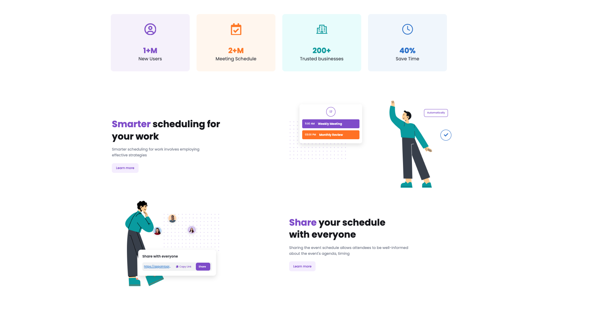
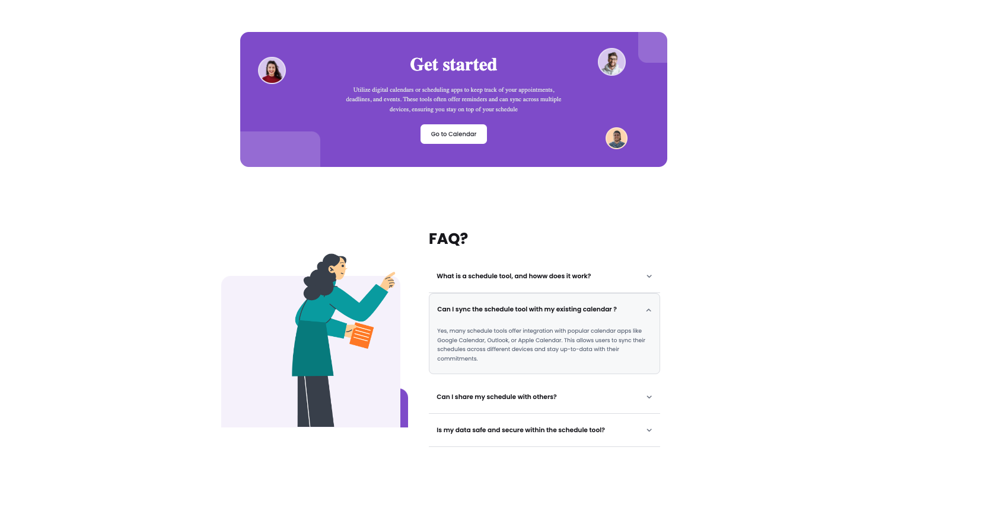
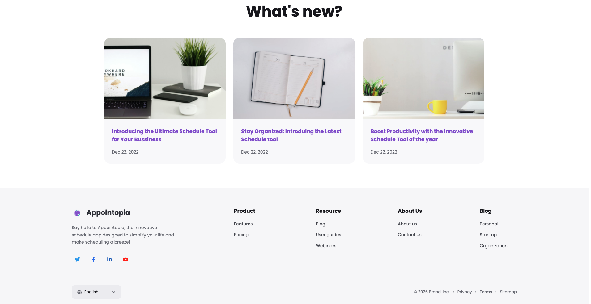

# Appointopia - Online Appointment Schedule

A modern, full-featured appointment scheduling application built with React. Manage your meetings, appointments, and schedules with an intuitive and responsive interface.

[](https://reactjs.org/)
[](https://firebase.google.com/)
[](https://vitejs.dev/)
[](https://www.emailjs.com/)

---

## Features

### Calendar Management
- Multiple Views: Day, Week, and Month views for flexible scheduling.
- Event Creation: Create, edit, and delete meetings with ease.
- Color Coding: Assign colors to different event types for better visualization.
- Smart Reminders: Get notified about upcoming meetings with automatic reminders.
- Search Meetings: Quick search functionality to find any meeting instantly.
- Smart Event Grouping: Expandable "+X More" views for days with many events.
- Meeting Invites: Add invitees with email notifications.
- Share Meetings: Copy meeting links or share via native share API.

### Appointment Scheduling
- Appointment Cards: Visual representation of all appointments with a unique V-shape hover effect.
- Booking Pages: Each appointment gets a unique, shareable booking page.
- Duration Management: Set custom durations for appointments (30, 60, 90 mins).
- Availability Settings: Define your working hours and availability per day.
- Workflow Automation: Set up automations around your events.
- Inline Editing: Edit appointments directly with full form controls.
- Color Picker: Choose from 10+ colors to customize appointment appearance.
- Professional Week View: Detailed calendar grid with time slots.

### Toast Notification System
- Real-time Feedback: Instant notifications for all user actions.
- Multiple Types: Support for Success, Error, Warning, Info, and Loading states.
- Auto-Dismiss: Configurable duration with a progress bar.
- Stack Support: Multiple notifications stack gracefully.
- Responsive Design: Works seamlessly on all screen sizes.
- Loading Transitions: Smooth transitions from loading to success/error states.

### User Management
- Authentication: Secure sign-in and sign-up with Firebase.
- Profile Management: Update personal information and preferences.
- User Settings: Customize your experience (notifications, default view, dark mode).
- Session Management: Auto-logout and session persistence.
- Delete Account: Securely delete your account with a confirmation prompt.

### Responsive Design
- Mobile-Friendly: Works seamlessly on all devices.
- Touch Optimized: Smooth interactions on touch devices.
- Adaptive Layouts: Interface auto-adjusts to different screen sizes.

### User Interface
- Modern Design: Clean, professional UI with a distinctive purple theme.
- Animations: Smooth transitions and interactions for a polished feel.
- V-Shape Hover: Unique card hover effects in the appointment grid.
- Iconography: Rich icon set for better visual communication.
- Typography: Clean, readable fonts for enhanced user experience.

---

## Screenshots

### Landing Page


### Landing Page - Stats & Features


### Landing Page - Get Started & FAQ


### Landing Page - What's New & Footer


### Sign Up


### Calendar - Add New Meeting


### Calendar - Week View


### Create Appointment - General Information


### Create Appointment - Schedule


### Appointment Details


### Appointment Schedule List


### Workflows - Templates


### Workflows - Create Workflow


---

## Tech Stack

### Frontend
| Technology | Version | Purpose |
|---|---|---|
| [React](https://reactjs.org/) | 19.2.8 | UI Framework |
| [React DOM](https://reactjs.org/) | 19.2.8 | DOM rendering for React |
| [React Router DOM](https://reactrouter.com/) | 7.18.2 | Navigation & Routing |
| [React Icons](https://react-icons.github.io/react-icons/) | 5.7.0 | Icon library |
| [react-icon](https://www.npmjs.com/package/react-icon) | 1.0.0 | Additional icon utilities |
| CSS3 | - | Custom styling with responsive design |

### Backend & Services
| Technology | Version | Purpose |
|---|---|---|
| [Firebase](https://firebase.google.com/) (Authentication, Firestore) | 12.18.0 | Backend-as-a-Service: auth and real-time NoSQL database |
| [EmailJS](https://www.emailjs.com/) (`@emailjs/browser`) | 4.4.1 | Email notifications for meeting invites |

### State Management
- React Context API - Global state management (Toast, Notifications, Appointments)
- Local Storage - Persistent data storage and caching

### Build & Development Tools
| Technology | Version | Purpose |
|---|---|---|
| [Vite](https://vitejs.dev/) | 8.2.1 | Build tool and development server |
| [@vitejs/plugin-react](https://www.npmjs.com/package/@vitejs/plugin-react) | 6.0.5 | Official React plugin for Vite |
| [oxlint](https://oxc.rs/docs/guide/usage/linter.html) | 1.78.0 | Code quality & linting |
| [@types/react](https://www.npmjs.com/package/@types/react) | 19.2.18 | TypeScript types for React |
| [@types/react-dom](https://www.npmjs.com/package/@types/react-dom) | 19.2.4 | TypeScript types for React DOM |
| Git | - | Version control |

---

## Project Structure

This reflects the actual structure of the `Appointopia-App/` folder in the repository:

```
Appointopia-App/
├── public/
│   └── favIcon.svg
├── src/
│   ├── assets/
│   │   ├── hero/                       # Hero section images
│   │   └── images/                     # Icons & general images (logo, social, illustrations)
│   ├── component/                      # Reusable UI components
│   │   ├── AppointmentSchedule/        # Appointment cards & schedule list
│   │   ├── AuthPage/                   # Sign in / Sign up
│   │   ├── Calendar/                   # Calendar views & modals
│   │   ├── Comman/                     # Shared Topbar component
│   │   ├── CreateAppointment/          # Appointment creation modal
│   │   ├── Faq/
│   │   ├── Footer/
│   │   ├── GetStarted/
│   │   ├── Hero/
│   │   ├── Navbar/
│   │   ├── Scheduling/
│   │   ├── Sidebar/
│   │   ├── Statistics/
│   │   ├── Toast/                      # Toast notification system
│   │   ├── WhatsNew/
│   │   ├── Workflows/                  # Workflow automation UI
│   │   ├── Layout.jsx                  # App shell layout (Sidebar + Topbar)
│   │   └── Layout.css
│   ├── context/                        # React Context providers
│   ├── data/                           # Seed/mock appointment data
│   ├── firebase/                       # Firebase app configuration
│   ├── hooks/
│   ├── layouts/                        # Layout wrapper for marketing/footer pages
│   │   └── FooterLayout.css
│   ├── pages/                          # Route-level pages
│   │   ├── AppointmentSchedulePage/
│   │   ├── CalendarPage/
│   │   ├── CompanyPage/
│   │   ├── FooterPages/                # Marketing / static content pages
│   │   │   ├── About/
│   │   │   ├── Blog/
│   │   │   ├── Legal/
│   │   │   ├── Product/
│   │   │   ├── Resource/
│   │   │   └── Page.css
│   │   ├── PricingPage/
│   │   ├── ProductPage/
│   │   ├── Profile/
│   │   ├── ResourcePage/
│   │   ├── Setting/
│   │   └── WorkflowsPage/
│   ├── services/                       # Firebase-backed data/service layer
│   ├── utils/                          # Utility helpers
│   ├── App.jsx                         # Root component & routes
│   ├── App.css
│   ├── index.css                       # Global styles
│   └── main.jsx                        # Application entry point
├── index.html
├── package.json
├── package-lock.json
├── vite.config.js
└── .oxlintrc.json                      # Linter config
```

---

## Getting Started

### Prerequisites
- Node.js v20.19.0 or higher (or v22.12.0+) - required by Vite 8 and oxlint
- npm or yarn package manager
- A Firebase account (for backend services)
- An EmailJS account (for email notifications)

### Installation

1. Clone the repository
   ```bash
   git clone https://github.com/lalit-sahu-iphtech/Online-Appointment-Schedule.git
   cd Online-Appointment-Schedule
   ```

2. Install dependencies
   ```bash
   npm install
   # or
   yarn install
   ```

3. Set up environment variables

   Create a `.env` file in the root directory. You can copy the example file:
   ```bash
   cp .env.example .env
   ```
   Then, fill in your credentials. The file should look like this:
   ```env
   # Firebase Configuration
   VITE_FIREBASE_API_KEY=your_api_key
   VITE_FIREBASE_AUTH_DOMAIN=your_auth_domain
   VITE_FIREBASE_PROJECT_ID=your_project_id
   VITE_FIREBASE_STORAGE_BUCKET=your_storage_bucket
   VITE_FIREBASE_MESSAGING_SENDER_ID=your_messaging_sender_id
   VITE_FIREBASE_APP_ID=your_app_id

   # EmailJS Configuration
   VITE_EMAILJS_SERVICE_ID=service_3oogfqs
   VITE_EMAILJS_PUBLIC_KEY=VDYus9qv_JpSadqdC
   VITE_EMAILJS_TEMPLATE_ID=template_pu4rw6s
   VITE_EMAILJS_CANCELLATION_TEMPLATE_ID=template_hxj5osd
   VITE_EMAILJS_REMINDER_SERVICE_ID=service_p6l3kgo
   VITE_EMAILJS_REMINDER_PUBLIC_KEY=aFl3ugmRys5Rp8nRQ
   VITE_EMAILJS_REMINDER_TEMPLATE_ID=template_znzmz0d
   VITE_EMAILJS_THANKYOU_TEMPLATE_ID=template_366oszd
   ```

4. Start the development server
   ```bash
   npm run dev
   # or
   yarn dev
   ```
   The application will be available at `http://localhost:5173`.

### Available Scripts
| Script | Command | Description |
|---|---|---|
| Development server | `npm run dev` | Starts Vite dev server |
| Build | `npm run build` | Builds the app for production |
| Lint | `npm run lint` | Runs oxlint on the codebase |
| Preview | `npm run preview` | Previews the production build locally |

---

## Environment Variables

| Variable | Description | Required |
|---|---|---|
| `VITE_FIREBASE_API_KEY` | Firebase Web API Key | Yes |
| `VITE_FIREBASE_AUTH_DOMAIN` | Firebase Authentication Domain | Yes |
| `VITE_FIREBASE_PROJECT_ID` | Firebase Project ID | Yes |
| `VITE_FIREBASE_STORAGE_BUCKET` | Firebase Storage Bucket | Yes |
| `VITE_FIREBASE_MESSAGING_SENDER_ID` | Firebase Messaging Sender ID | Yes |
| `VITE_FIREBASE_APP_ID` | Firebase App ID | Yes |
| `VITE_EMAILJS_SERVICE_ID` | EmailJS Service ID | Yes |
| `VITE_EMAILJS_TEMPLATE_ID` | EmailJS Template ID | Yes |
| `VITE_EMAILJS_PUBLIC_KEY` | EmailJS Public Key | Yes |

---


## Author

**Lalit Sahu**

[](https://github.com/lalit-sahu-iphtech)
[](#)

Made by Lalit Sahu